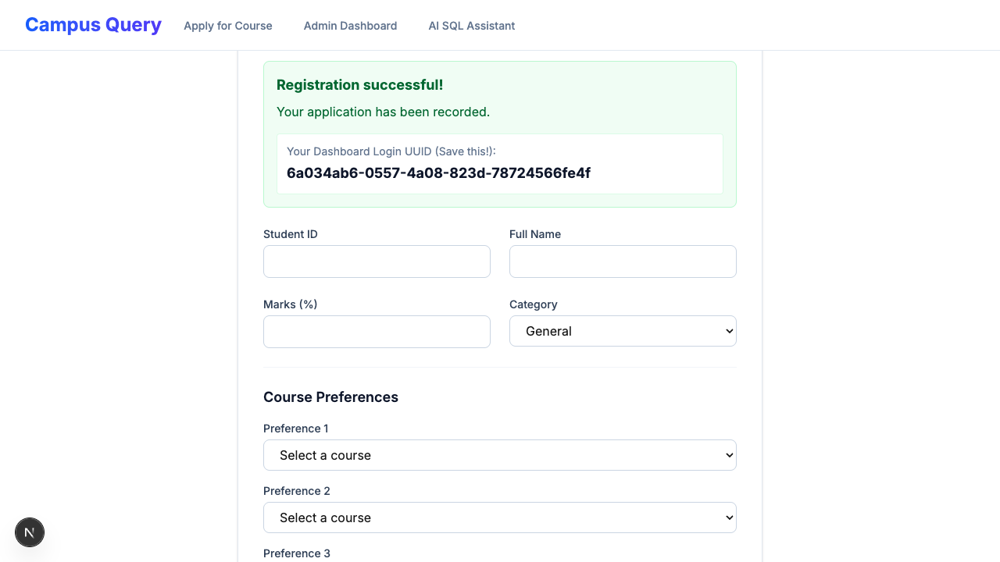
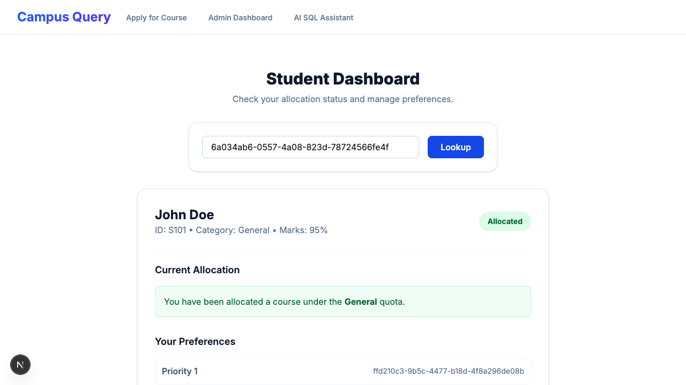
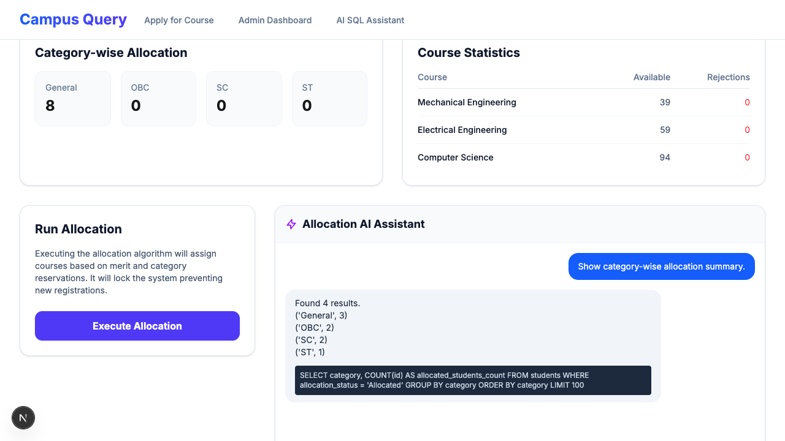
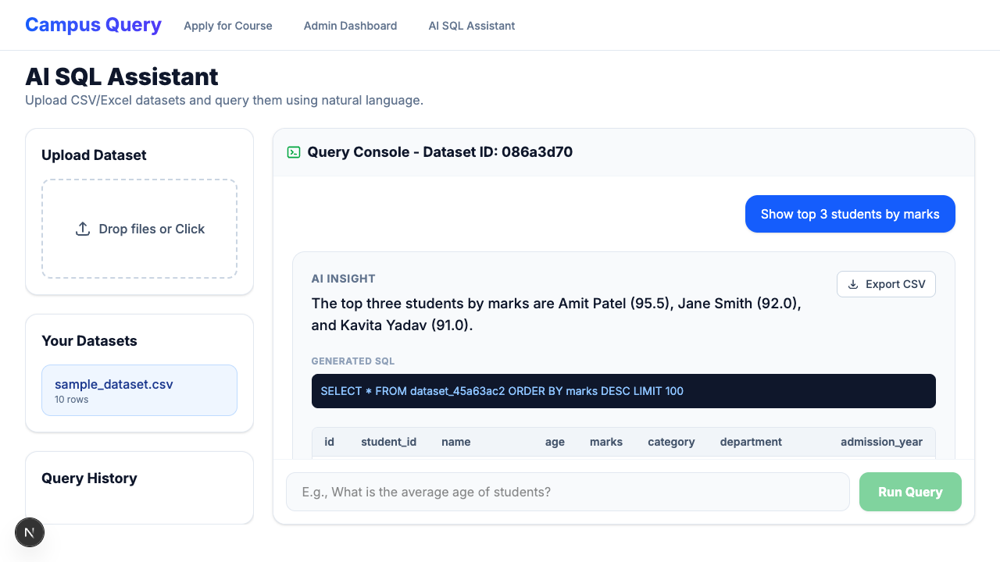

# Campus Query

Campus Query is an AI-Powered Student Course Allocation System and intelligent SQL Data Assistant built with a modern stack:
- **Frontend**: Next.js 16, React, TailwindCSS
- **Backend**: FastAPI, SQLAlchemy, Pydantic, Pandas
- **Database**: PostgreSQL 15 (via Colima Docker)
- **AI Integration**: Google GenAI SDK (Gemini Pro/Flash)

## Prerequisites
- Node.js (v18+)
- Python 3.11+
- Colima and Docker (`brew install colima docker docker-compose`)
- Google Gemini API Key

## Setup Instructions

### 1. Database Setup
Ensure Colima is running:
```bash
colima start
```
Start the PostgreSQL database (this will automatically seed the roles and schemas):
```bash
docker compose up -d
```

To load the initial database schema and comprehensive seed data (useful for testing all allocation scenarios):
```bash
cat schema.sql | docker compose exec -T db psql -U postgres -d student_portal_db
cat backend/scripts/seed_data.sql | docker compose exec -T db psql -U postgres -d student_portal_db
```

### 2. Backend Setup
Navigate to the `backend` directory, activate the virtual environment, and run the server:
```bash
cd backend
python3 -m venv .venv
source .venv/bin/activate
pip install -r requirements.txt # (or install dependencies manually if needed)
uvicorn src.main:app --reload --port 8000
```
> Note: A `.env.example` file is provided in the root directory. Copy it to `.env` (`cp .env.example .env`) and insert your actual `GEMINI_API_KEY`. The database URLs are pre-configured to match the Docker setup.

### 3. Frontend Setup
Navigate to the `frontend` directory, install dependencies, and run the Next.js development server:
```bash
cd frontend
npm install
npm run dev
```
> Note: Admin routes are protected by Basic Authentication. Ensure you create a `frontend/.env.local` file and set `ADMIN_USER` and `ADMIN_PASSWORD` there (refer to the root `.env.example` for recommended test credentials: `rani` / `assignment@123`). If left unset, the defaults are `admin` / `password123`.

## Features
1. **Student Course Allocation**: Merit-based seat allocation with category-specific quotas (General, OBC, SC, ST).
2. **Dynamic AI SQL Assistant**: Upload any CSV/Excel file, and immediately query it using natural language. The system dynamically generates an isolated PostgreSQL table.
3. **Admin Dashboard**: Run allocation logic, view live stats, and ask AI questions about the allocation outcomes safely.

## Documentation
For a deeper dive into the system design and endpoints, please refer to:
- [Architecture Document](./docs/architecture.md)
- [API Documentation](./docs/API_Documentation.md)

## Screenshots
- **Student Registration**: 
- **Student Dashboard**: 
- **Admin Dashboard**: 
- **AI SQL Assistant**: 
